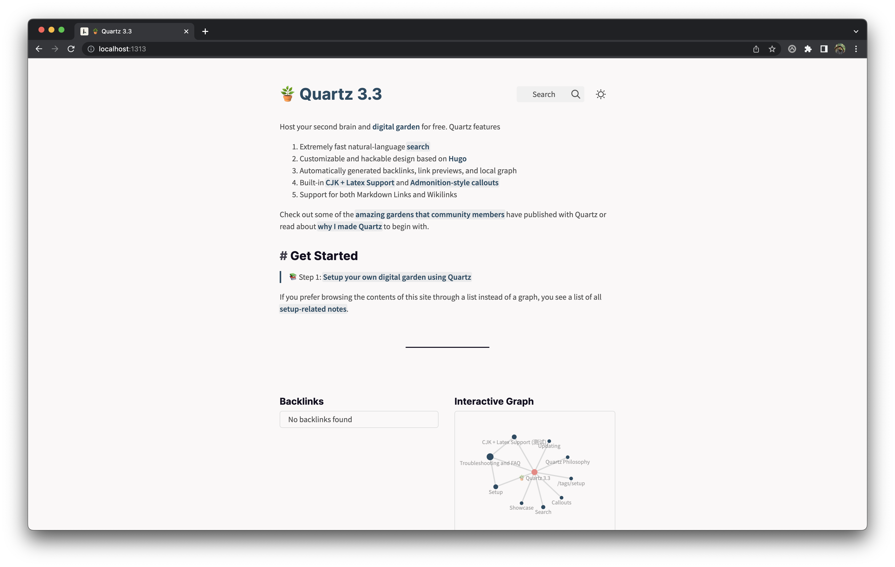

# 笔记地址
- [clickear/knowledge-garden](https://github.com/clickear/knowledge-garden) (Updated: f1669b696866e1dd7af6109d1533adacf0d941c7)

# Quartz

Host your second brain and [digital garden](https://jzhao.xyz/posts/networked-thought) for free. Quartz features

1. Extremely fast natural-language search
2. Customizable and hackable design based on Hugo
3. Automatically generated backlinks, link previews, and local graph
4. Built-in CJK + Latex Support and Admonition-style callouts
5. Support for both Markdown Links and Wikilinks

Check out some of the [amazing gardens that community members](https://quartz.jzhao.xyz/notes/showcase/) have published with Quartz!

> “[One] who works with the door open gets all kinds of interruptions, but [they] also occasionally gets clues as to what the world is and what might be important.” — Richard Hamming

🔗 Get Started: https://quartz.jzhao.xyz/

*Quartz Example Screenshot*

[Join the Discord Community](https://discord.gg/cRFFHYye7t)
